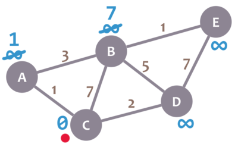
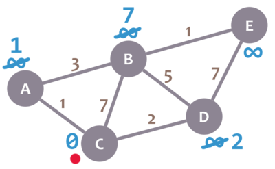
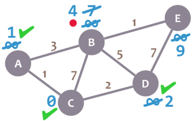

# Dijkstra's Algorithm

Dijkstra's Algorithm allows you to calculate the shortest path between one node (you pick which one) and _every other node in the graph_. Let's study the algorithm with an explained example! Let's calculate the shortest path between node C and the other nodes in our graph:

During the algorithm execution, we'll mark every node with its _minimum distance_ to node C (our selected node). For node C, this distance is 0. For the rest of nodes, as we still don't know that minimum distance, it starts being infinity (∞):

We'll also have a _current node_. Initially, we set it to C (our selected node). In the image, we mark the current node with a red dot.

Now, we check the neighbours of our current node (A, B and D) in no specific order. Let's begin with B. We add the minimum distance of the current node (in this case, 0) with the weight of the edge that connects our current node with B (in this case, 7), and we obtain 0 + 7 = 7. We compare that value with the minimum distance of B (infinity); the lowest value is the one that remains as the minimum distance of B (in this case, 7 is less than infinity):

So far, so good. Now, let's check neighbour A. We add 0 (the minimum distance of C, our current node) with 1 (the weight of the edge connecting our current node with A) to obtain 1. We compare that 1 with the minimum distance of A (infinity), and leave the smallest value:

OK. Repeat the same procedure for D:

Great. We have checked all the neighbours of C. Because of that, we mark it as _visited_. Let's represent visited nodes with a green check mark:

We now need to pick a new _current node_. That node must be the unvisited node with the smallest minimum distance (so, the node with the smallest number and no check mark). That's A. Let's mark it with the red dot:

And now we repeat the algorithm. We check the neighbours of our current node, ignoring the visited nodes. This means we only check B.

For B, we add 1 (the minimum distance of A, our current node) with 3 (the weight of the edge connecting A and B) to obtain 4. We compare that 4 with the minimum distance of B (infinity) and leave the smallest value: 4.

Afterwards, we mark A as visited and pick a new current node: D, which is the non-visited node with the smallest current distance.

We repeat the algorithm again. This time, we check B and E.

For B, we obtain 2 + 5 = 7. We compare that value with B's minimum distance (4) and leave the smallest value (4). For E, we obtain 2 + 7 = 9, compare it with the minimum distance of E (infinity) and leave the smallest one (9).

We mark D as visited and set our current node to B.

Almost there. We only need to check E. 4 + 1 = 5, which is less than E's minimum distance (9), so we leave the 5. Then, we mark B as visited and set E as the current node.

E doesn't have any non-visited neighbours, so we don't need to check anything. We mark it as visited.

As there are not univisited nodes, we're done! The minimum distance of each node now actually represents the minimum distance from that node to node A (the node we picked as our initial node)!

Here's a description of the algorithm:
1. Mark your selected node with a current distance of 0 and the rest with infinity.
2. Set the non-visited node with the smallest current distance as the current node C.
3. For each neighbour N of your current node: add the current distance of C with the weight of the edge connecting C-N. If it's smaller than the current distance of N, set it as the new current distance of N.
4. Mark the current node as visited.
5. If there are unvisited nodes, go to step 2.

# Exercise
The shown function is used during step 2 in the algorithm. It selects the node that should be set as current node. Fix it so it picks the correct node.

@[The shown function should select a new current node for Dijkstra's Algorithm. Fix it so it does it correctly.]({"stubs": ["nodes.py"], "command": "python3 test_nodes.py"})

# Next step
To obtain the paths that correspond to those minimum values, we simply need to keep track of the nodes every time we change the minimum distance of a node. Keep reading to check it out!